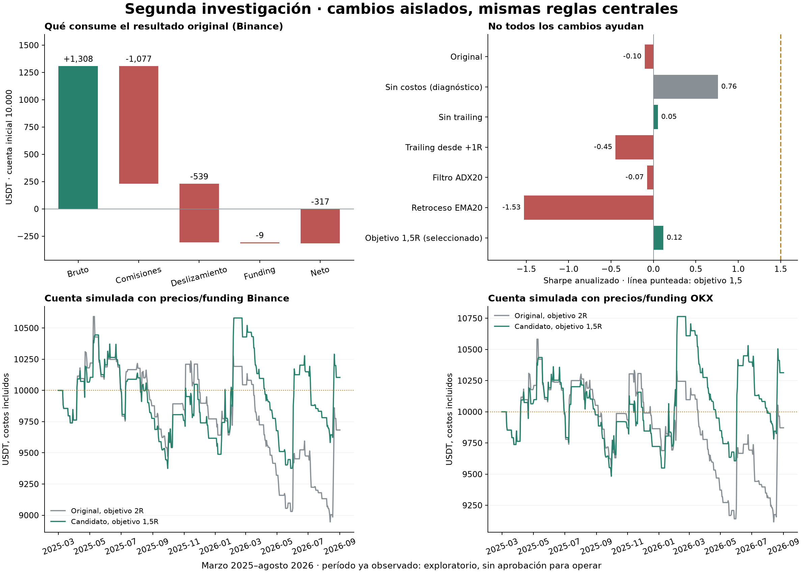

# Segunda investigación: qué vuelve negativa a la estrategia

**Se completaron 200 intentos en esta ronda (30 controles y cambios aislados + 170 configuraciones focalizadas). No se alcanzó Sharpe 1,5.** Los 200 intentos anteriores permanecen registrados; los 400 intentos acumulados incluyen controles repetidos entre rondas.

La comparación usa marzo de 2025–agosto de 2026, los mismos 18 meses ya observados. Es **investigación exploratoria**, no una nueva validación independiente. La comprobación adicional con OKX usa ese mismo período de BTC y tampoco es una muestra temporal independiente.

## Resultado principal

Se mantuvieron activo BTC, futuros perpetuos, ancla de 4h, señales de 1h, longs y shorts, ATR14, EMA8/60, ruptura de 168 horas, stop de 4 ATR, trailing de 2 ATR y presupuesto nominal de riesgo de 2%. La variante elegida cambia **solamente el objetivo de 2R a 1,5R**.

La elección del intento **#104** se hizo por estabilidad en las tres ventanas de desarrollo 2022–febrero de 2025. No se eligió el mejor Sharpe del período conocido; algunas variantes aisladas tienen un resultado mayor allí, lo que no autoriza a elegirlas mirando esa prueba.

| Métrica de los 18 meses conocidos | Original | Objetivo 1,5R |
|---|---:|---:|
| Sharpe — datos Binance | -0.102 | 0.117 |
| Retorno neto — datos Binance | -3.17% | 1.04% |
| Drawdown — datos Binance | 15.64% | 11.38% |
| Operaciones — datos Binance | 124 | 129 |
| Sharpe — precios y funding OKX | -0.001 | 0.229 |
| Retorno neto — precios y funding OKX | -1.28% | 3.14% |
| Drawdown — precios y funding OKX | 13.93% | 10.75% |



## Qué explica la pérdida original

Sobre 10.000 USDT iniciales, la contabilidad exacta de las operaciones originales es:

| Componente | USDT |
|---|---:|
| P&L bruto antes de costos de ejecución | 1308.11 |
| Menos comisiones de entrada y salida | −1077.29 |
| Menos deslizamiento | −538.65 |
| Menos funding neto | −9.31 |
| P&L neto | -317.15 |

Esto es una descomposición del mismo camino de operaciones. Los backtests contrafactuales de costos cero pueden dar otra cifra porque cambian el tamaño y el capital de operaciones posteriores. **Eliminar todos los costos solo produce Sharpe 0,759**: por sí solo, abaratar la ejecución no lleva a 1,5.

El punto de equilibrio contable sería aproximadamente **4.23 bps de comisión por lado**, conservando las mismas operaciones y el deslizamiento supuesto. La API de la cuenta demo informa actualmente **5 bps taker**, frente a los 6 bps conservadores del estudio. Esa diferencia ayuda, pero no alcanza el punto de equilibrio de la original bajo ese cálculo; no se han supuesto fills maker gratuitos ni se ha borrado el funding. La tarifa actual no prueba qué tarifa hubiese correspondido en todo el historial.

**Longs:** 70 operaciones, −901,39 USDT, acierto 24,3%. **Shorts:** 54 operaciones, +584,25 USDT, acierto 40,7%. Hay una asimetría a investigar, pero el diagnóstico short-only tiene Sharpe 0,467 y no cumple el objetivo ni la condición de operar ambos sentidos. No se eliminaron los longs.

**Trailing:** las 113 salidas por stop ocurrieron después de ajustes del trailing. En 68 operaciones, el primer ajuste se hizo con la posición perdiendo; la mediana fue −0,026R. Es un comportamiento confirmado, pero las intervenciones muestran que no es una solución universal retrasarlo: activar a 1R empeora el Sharpe conocido a −0,446, y quitarlo solo llega a 0,052. El trailing también evita pérdidas mayores. No se desactivó por intuición.

**Objetivo:** pasar de 2R a 1,5R permite cobrar algunos movimientos que antes terminaban devolviendo la ganancia. El resultado mejora modestamente, pero no en todos los semestres. Es la única modificación seleccionada; no es una estrategia aprobada.

**Entradas y filtros:** el retroceso con cruce de EMA20 ensayado da Sharpe −1,526; el filtro ADX20 no resuelve el problema, y acortar la ruptura a 72h tampoco. Se rechazaron esas variantes específicas. Esto no prueba que todas las estrategias de retrocesos fallen; sí evita incorporar esta sin evidencia.

**Riesgo:** subir el presupuesto de 2% a 3% deja Sharpe −0,023 en el diagnóstico y sigue sin lograr el objetivo. El riesgo nominal promedio de la original fue 1.83%, por el límite de exposición 1x. Aumentar riesgo no crea una ventaja en las señales; se conserva 2%.

## Comparaciones cambiando un componente

Cada fila cambia únicamente lo indicado respecto de la original. Los controles con costos cero, un solo sentido o riesgo 3% sirven para diagnóstico y se excluyeron de la selección.

| Cambio | Score de desarrollo | Sharpe conocido | Retorno conocido | Trades | Seleccionable |
|---|---:|---:|---:|---:|---|
| baseline | 0.688 | -0.102 | -3.17% | 124 | Sí |
| zero_fees_diagnostic | 1.055 | 0.477 | 8.64% | 124 | Solo diagnóstico |
| zero_slippage_diagnostic | 0.868 | 0.175 | 2.19% | 124 | Solo diagnóstico |
| zero_funding_diagnostic | 0.706 | -0.098 | -3.09% | 124 | Solo diagnóstico |
| zero_all_costs_diagnostic | 1.249 | 0.759 | 15.16% | 124 | Solo diagnóstico |
| double_costs_stress | 0.141 | -1.367 | -22.18% | 117 | Solo diagnóstico |
| long_only_diagnostic | 0.926 | -0.632 | -8.71% | 70 | Solo diagnóstico |
| short_only_diagnostic | 0.222 | 0.467 | 6.07% | 54 | Solo diagnóstico |
| risk_3pct_diagnostic | 0.771 | -0.023 | -2.79% | 124 | Solo diagnóstico |
| trailing_off | 0.169 | 0.052 | -1.27% | 89 | Sí |
| trailing_width_3 | 0.511 | -0.477 | -11.94% | 112 | Sí |
| trailing_width_4 | 0.213 | 0.155 | 1.85% | 98 | Sí |
| trailing_width_6 | 0.395 | 0.180 | 2.50% | 91 | Sí |
| trailing_activation_0.5R | 0.867 | -0.214 | -6.88% | 101 | Sí |
| trailing_activation_1.0R | 0.222 | -0.446 | -11.53% | 76 | Sí |
| trailing_activation_2.0R | 0.169 | 0.052 | -1.27% | 89 | Sí |
| target_off | 0.681 | 0.205 | 2.92% | 115 | Sí |
| target_3R | 0.758 | 0.285 | 4.60% | 120 | Sí |
| target_4R | 0.664 | 0.244 | 3.87% | 117 | Sí |
| initial_stop_2ATR | 0.640 | -0.839 | -19.98% | 144 | Sí |
| initial_stop_3ATR | 0.777 | 0.100 | 0.57% | 130 | Sí |
| initial_stop_5ATR | 0.611 | 0.017 | -0.60% | 122 | Sí |
| ADX_15 | 0.114 | -0.028 | -1.71% | 119 | Sí |
| ADX_20 | -0.355 | -0.075 | -2.38% | 103 | Sí |
| ADX_25 | -0.322 | -0.357 | -6.06% | 74 | Sí |
| cooldown_6h | 0.280 | -0.317 | -6.49% | 116 | Sí |
| cooldown_12h | 0.480 | -0.211 | -4.56% | 107 | Sí |
| pullback_EMA20 | -1.598 | -1.526 | -23.94% | 128 | Sí |
| anchor_EMA20_100 | 0.383 | -0.151 | -3.75% | 102 | Sí |
| breakout_72h | 0.091 | -0.222 | -6.17% | 168 | Sí |

## Robustez e incertidumbre

Se ejecutaron **6.000 caminos Monte Carlo**, 2.000 para cada longitud de bloque de 3, 7 y 14 días, sobre retornos diarios netos del candidato. Con bloques de 7 días, el intervalo percentil 5–95 del Sharpe es **[-1.559, 1.457]** y la fracción de caminos con pérdida es 46.7%. No respalda un Sharpe objetivo de 1,5.

Otros 2.000 caminos emparejados comparan candidato y original sobre los mismos bloques de fechas. El intervalo 5–95 de la diferencia de Sharpe es **[-0.327, 0.732]**. Esto describe la incertidumbre condicional en la mejora observada; no es una probabilidad de éxito futuro.

Con comisiones y deslizamiento duplicados, el candidato cae a Sharpe **-0.793** y retorno **-13.90%**. El DSR aproximado, contando las evaluaciones de ambas rondas, es 2.70%; no es una certificación y sus supuestos de independencia entre intentos son imperfectos.

Los semestres se evaluaron por separado, reiniciando capital y posición para comparar estabilidad; no se suman como si fueran una única cuenta continua:

| Período | Sharpe original | Sharpe candidato |
|---|---:|---:|
| 2025-03-01 → 2025-09-01 | -0.131 | -0.344 |
| 2025-09-01 → 2026-03-01 | 0.309 | 1.007 |
| 2026-03-01 → 2026-09-01 | -0.550 | -0.504 |

## Decisión y próximos pasos

- **Mantener** activo, futuros, 1h/4h, ambos sentidos y presupuesto de riesgo. Estas restricciones no quedaron identificadas como causas mediante las pruebas realizadas; tampoco se demuestra que sean óptimas.
- **Conservar 1,5R solo como candidato de investigación**, sin reemplazar la configuración del servicio ni habilitar órdenes reales.
- **No incorporar** el retraso del trailing, ADX o pullback ensayados: no mostraron una mejora estable que justifique agregarlos.
- La evidencia apunta a **una ventaja bruta débil y sensible al régimen, consumida por costos**, con especial debilidad de los longs. Una futura ronda tendría que plantear una hipótesis verificable para distinguir entradas long con continuidad de falsas rupturas, con datos no usados para elegir esas reglas.
- Terminar esta ronda en sus 200 intentos. Un Sharpe aceptable requeriría evidencia futura independiente; reutilizar el período conocido o cambiar de Binance a OKX no la crea.

No se enviaron órdenes, no se modificó la cuenta OKX ni se cambió `configs/selected.json`.

## Reproducibilidad

```bash
python -m astra.second_research --output reports/run-002 --budget 200
python -m astra.okx_history
python -m astra.round_two_report
```

El primer comando rechaza sobrescribir una ronda ya iniciada; los otros reconstruyen datos/reportes de los candidatos ya fijados, sin búsqueda adicional. Los datos descargados quedan en `data/okx/`, fuera de Git; el manifiesto de fuentes y hashes está en `okx_data_manifest.json`.

El nuevo simulador de diagnóstico reproduce la curva original a precisión numérica y separa comisiones, funding, deslizamiento y motivo exacto del stop. Sus indicadores ADX y pullback se verifican con pruebas de invariancia al truncar datos futuros. No se modifica el simulador ni el servicio anterior.

Fuentes: [API y datos históricos oficiales OKX](https://www.okx.com/docs-v5/en/#public-data-rest-api-get-historical-market-data), [datos históricos OKX](https://www.okx.com/historical-data), [archivos oficiales Binance](https://github.com/binance/binance-public-data), [Bailey et al., backtest overfitting](https://www.davidhbailey.com/dhbpapers/overfitting.pdf).
